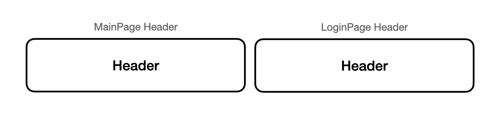
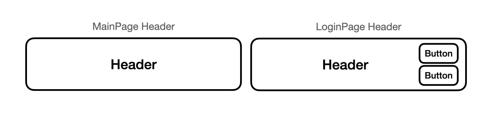

# 컴포넌트 설계

컴포넌트 설계란 컴포넌트를 구성하는 뼈대를 정의해 구현의 기반을 만드는 것을 의미합니다. 컴포넌트 설계에 대해 자세하게 알아보기 전에 컴포넌트가 만들어진 배경과 장점에 대해서 가볍게 알아봅시다.

## 웹 컴포넌트(Web Components)

모던 자바스크립트 프레임워크인 React, Vue.js, Angular는 모두 **컴포넌트 기반 프레임워크**입니다. 모던 자바스크립트 프레임워크가 컴포넌트 기술을 채택하기 전부터 컴포넌트에 대한 요구사항이 있었습니다. HTML 요소가 같은 요소라도 여러 브라우저와 운영체제에 따라 다르게 동작하거나, HTML5 이외에도 여러 기능을 지원하는 요소가 필요했기 때문입니다. 또한 같은 내용의 코드가 여러 페이지에서 사용되어 반복된 코드 작성이 발생했기 때문입니다. 따라서, 웹 기술의 표준을 정의하는 W3C에서는 HTML의 한계를 개선하고자 "웹 컴포넌트" 라는 표준 명세를 만들었습니다.

웹 컴포넌트는 웹 애플리케이션을 구성하는 뷰(View) 요소를 하나의 단위로 묶는 것을 말합니다. 여기서 말하는 뷰 요소는, 내용과 구조를 담당하는 HTML, 스타일을 담당하는 CSS, DOM 조작과 이벤트 관리를 담당하는 Javascript로 이루어져 있습니다.

즉, 웹 컴포넌트는 웹 애플리케이션에서 재사용 가능하도록 캡슐화된 HTML 커스텀 요소(Custom Element)를 생성하는 웹 플랫폼 API의 집합입니다. 웹 컴포넌트가 제공해야 하는 기능은 총 4가지로 구분될 수 있습니다.

- **Custom Elements** : 요소의 동작을 사용자가 원하는대로 정의 할 수 있다.
- **Shadow DOM** : 외부로부터 간섭을 제한하기 위해 스코프(scope)를 분리하여 DOM을 캡슐화 할 수 있다.
- **ES Modules** : Javascript 파일끼리 서로 접근할 수 있다.
- **HTML Template** : `<template>`, `<slot>` 요소를 사용해 렌더링된 페이지에 나타자니 않는 마크업을 작성하고, 재사용 할 수 있다.

웹 컴포넌트는 기존에 정의된 HTML을 사용자가 정의해 새로운 기능을 가진 HTML로 만들어 사용할 수 있게 했습니다. 또한 복잡한 코드를 캡슐화해 태그 하나로 정의한 동작을 할 수 있게 했습니다.

표준 영역에서 웹 컴포넌트가 달성하고자 했던 모습을, 모던 자바스크립트 프레임워크에서 사용할 수 있습니다.

:::tip
웹 컴포넌트에 대해 더 자세하고 알고 싶다면, [여기](https://www.webcomponents.org/introduction)를 참고하세요.
:::


## 컴포넌트 설계의 중요성

모던 자바스크립트 프레임워크에서 컴포넌트 기반 기술을 적용한 이유에 대해서 살펴봤습니다.

설계를 거치지 않고 컴포넌트를 만들게 되면, 당장의 애플리케이션에 큰 영향은 없을 수 있습니다. 하지만, 애플리케이션의 크기가 커지거나 고도화 되어야 하는 프로젝트에서 유지보수와 개발 진행 단계에 영향을 줄 수 있습니다. 컴포넌트가 어떻게 설계되느냐에 따라 개발 속도와 코드의 가독성, 효율성에서 차이가 나기 때문입니다.

### 좋은 설계가 가지는 특징

#### 코드 재사용성과 확장성

코드 재사용성은 한번 만들어진 컴포넌트를 여러 곳에서 사용할 수 있음을 말합니다. 그리고 확장성은 코드의 상당 부분을 변경하지 않고도 UI 또는 기능을 추가할 수 있음을 말합니다. 아래와 같이 서로 다른 페이지의 구성요소를 만들었다고 가정합시다.



AppHeader 컴포넌트는 MainPage에서도 사용될 수 있고, LoginPage에서도 사용될 수 있습니다.

```html
<!-- AppHeader.vue -->
<template>
  <header>
    <h1>Header</h1>
  </header>
</template>
```

```html
<!-- MainPage.vue, LoginPage.vue -->
<template>
  <div>
    <app-header></app-header>
  </div>
</template>

<script>
import AppHeader from './AppHeader.vue';

export default {
  components: {
    AppHeader,
  },
};
</script>
```

AppHeader 컴포넌트는 MainPage와 LoginPage 두 파일에서 동일한 내용으로 재사용 되었습니다. 여기에서 LoginPage의 AppHeader에 아래 사진과 같이 Button이 추가되어야 한다고 가정해보겠습니다.



이를 구현하기 위해서 `v-if` 디렉티브를 사용해, Button을 그룹화 하여 조건에 따라 다르게 나타낼 수 있습니다.

```html
<!-- AppHeader.vue -->
<template>
  <header>
    <h1>Header</h1>
    <template v-if="side">
      <button>button1</button>
      <button>button2</button>
    </template>
  </header>
</template>

<script>
export default {
  computed: {
    side() {
      if (this.$route.path.includes('/login')) {
        return true;
      }
      return false;
    },
  },
};
</script>
```

하지만, `<template>` 태그로 묶인 하위 요소는 반드시 `<button>` 태그 2개로 고정되어야 합니다. 만약, 다른 페이지에서 버튼이 아닌 다른 태그를 사용해야한다면 AppHeader 컴포넌트를 수정하거나 `v-if` 디렉티브의 조건이 더욱 까다롭게 될 것입니다. 즉, 확장성이 떨어지는 컴포넌트라고 볼 수 있습니다.

확장성을 고려한 코드로 재구성 해보면 아래와 같이 슬롯을 통해 표현할 수 있습니다.

```html
<!-- HeaderComponent.vue -->
<template>
  <header>
    <h1>Header</h1>
    <slot name="side"></slot>
  </header>
</template>
```

```html
<!-- LoginPage.vue -->
<template>
  <header-component>
    <template v-slot:side>
      <button>Button1</button>
      <button>Button2</button>
    </template>
  </header-component>
</template>

<script>
import HeaderComponent from '../HeaderComponent.vue';
  
export default {
  components: {
    HeaderComponent,
  }
}
</script>
```

MainPage는 동일한 코드로 작성되지만, LoginPage는 슬롯 안에 요소를 선언하여 표현했습니다. 만약 다른 페이지에서 버튼 외 다른 요소가 들어가야 한다면 다르게 정의하여 표현할 수 있습니다. 따라서 확장성이 용이한 컴포넌트가 만들어졌습니다.

#### 관심사에 따라 코드를 분리하고 단일 책임을 가짐

관심사에 따라 한 가지의 역할만 수행하는 것을 **단일 책임 원칙** 이라고 합니다. 하나의 컴포넌트가 하나의 책임을 지도록 작게 쪼개는 것입니다. 책상의 서랍장에 모든 필요한 물건을 넣고, 필요한 것을 찾으려면 복잡한 서랍장 안을 찾아야 합니다. 하지만 서랍장을 용도에 맞게 분류하고 용도에 맞는 물건을 넣어두면 쉽게 찾을 수 있습니다. 작은 컴포넌트는 읽기도 쉽고 수정하기도 안전합니다.

간단한 Todo App을 만들고 단일 책임을 가지는 컴포넌트로 리팩토링 해보겠습니다.

```html
<!-- App.vue -->
<template>
  <div>
    <header>
      <nav />
      <div>
        <h1>{{ todoCount }}</h1>
      </div>
    </header>
    <main>
      <div>
        <div>
          <div
            v-for="{ id, title, completed } in todos"
            :key="id"
          >
            <span :class="{ 'todo-list__task--completed': completed }">
              {{ title }}
            </span>
          </div>
        </div>
      </div>
    </main>
  </div>
</template>

<script>
export default {
  data() {
    return {
      todos: [],
    };
  },
  computed: {
    todoCount() {
      return `${this.todos.length}개`;
    },
  },
  mounted() {
    this.fetchTodos();
  },
  methods: {
    async fetchTodos() {
      const response = await fetch('https://jsonplaceholder.typicode.com/todos/');
      const todos = await response.json();
      this.todos = todos;
    }
  },
};
</script>
```

아래와 같은 변경 점이 생길 수 있습니다.

1. 할 일을 가져오기 위한 `fetchTodos()` 메서드를 변경. (axios 라이브러리로 교체하거나, url 주소를 변경할 때)
2. 사이드바, 메뉴, 푸터 등 더 많은 요소를 추가.
3. 헤더 또는 할 일 목록과 같은 기존 요소를 변경.

변경점이 생겼을 때, 작은 단위의 애플리케이션이기 때문에 코드를 바로 수정할 수 있지만, 애플리케이션이 너무 커지게 되면 코드를 파악하는 것이 쉽지 않습니다. 따라서 아래와 같이 관심사를 분리할 수 있습니다.

우선, 데이터를 가져오는 `fetch()` 부분을 `api.js` 로 분리하겠습니다.

```js
// api.js
const baseUrl = 'https://jsonplaceholder.typicode.com';

export const fetchData = async item => {
  const response = await fetch(`${baseUrl}/${item}`);
  return await response.json();
};
```

이제 baseUrl이 바뀌거나, 가져와야할 대상(item)이 바뀌었을 때 쉽게 교체가 가능합니다. `api.js` 는 단순히 데이터를 서버로부터 가져오는 역할만 담당합니다.

다음으로 헤더를 분리시키겠습니다.

```html
<!-- Header.vue -->
<template>
  <header>
    <nav />
    <div>
      <h1>{{ todoCount }}</h1>
    </div>
  </header>
</template>

<script>
export default {
  props: ['todoCount'],
};
</script>
```

그리고 마지막은 할 일 목록을 분리시키는 것입니다.

```html
<!-- TodoList.vue -->
<template>
  <div class="container">
    <div class="todo-list">
      <div
        v-for="{ id, title, completed } in todos"
        :key="id"
        class="todo-list__task"
      >
        <span :class="{ 'todo-list__task--completed': completed }">
          {{ title }}
        </span>
      </div>
    </div>
  </div>
</template>

<script>
export default {
  props: ['todos'],
};
</script>
```

이렇게 컴포넌트를 역할 별로 나누었고, `App.vue` 에서 조립하겠습니다.

```html
<!-- App.vue -->
<template>
  <div>
    <Header :todo-count="todoCount" />
    <main>
      <TodoList :todos="todos" />
    </main>
  </div>
</template>

<script>
import Header from '../Todo/Header.vue';
import TodoList from '../TodoList.vue';
import { fetchData } from '../api.js';

export default {
  components: {
    Header,
    TodoList,
  },
  data() {
    return {
      todos: [],
    };
  },
  computed: {
    todoCount() {
      return `${this.todos.length}개`;
    },
  },
  async mounted() {
    this.todos = await this.fetchTodos();
  },
  methods: {
    async fetchTodos() {
      return await fetchData('todos');
    },
  },
};
</script>
```

이제 코드의 관심사가 분리되었으니 읽기도 쉽고 변경 점이 생길 때 빠르게 변경할 수 있습니다. 관심사가 분리될수록 [테스트 코드](/testing/tutorial-todo-app.html#할-일-추가하기)를 작성하기도 쉬워집니다.


#### 외부에 제어를 위임


### 좋지 않은 설계가 가지는 특징

#### 코드의 가독성과 유지보수 효율성 저하

컴포넌트를 

